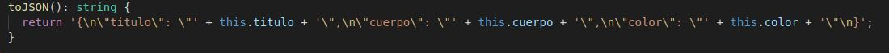
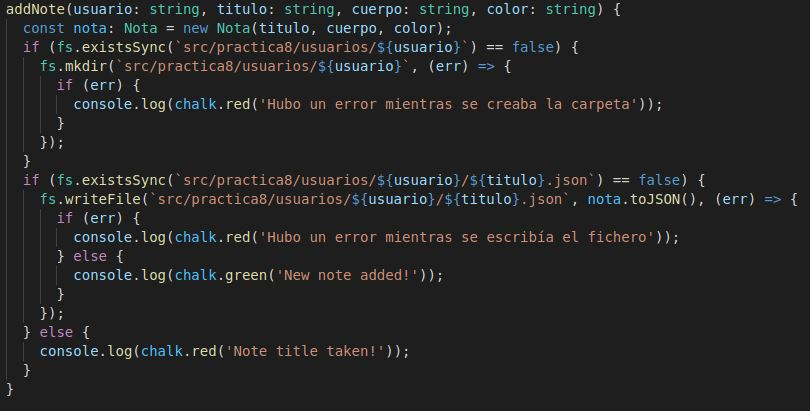
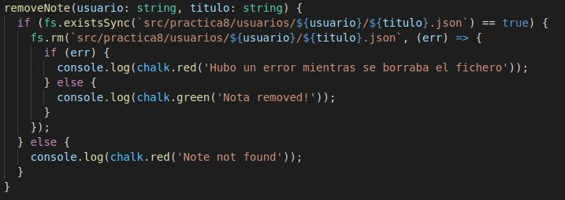
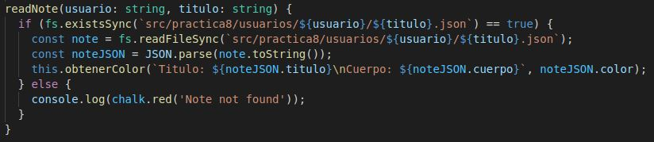
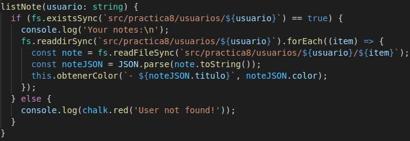
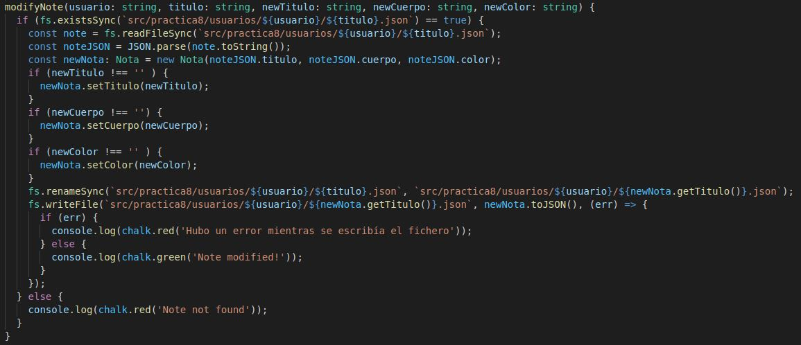

# INFORME PRACTICA 8
## Aplicación de procesamiento de notas de texto
### ALBERTO RIOS DE LA ROSA
### alu0101235929@ull.edu.es

### INTRODUCCIÓN

Esta práctica tiene como objetivo principal implementar una aplicación de procesamiento de notas de texto, para así seguir evolucionando en nuestro aprendizaje en la materia. Al igual que las anteriores practicas se deberá desarrollar la documentación y la realización de pruebas mediante la metodología TDD, ademas del gitHub Acctions y del sonar cloud. Primero explicaremos en un principio como crear este método de manera breve, y más tarde mostraremos la solución de cada uno de los ejercicios propuestos, que al tener varios ficheros cada ejercicio se encontrará resuelto en una carpeta dentro de la src para cada ejercicio, con una breve explicación de cada uno y unas capturas de pantalla en el que se muestra que se han superado las distintas pruebas de ese ejercicio junto al link de donde se crearon las pruebas. Si desea leer los enunciados de cada ejercicio los podrás encontrar pinchando [aqui](https://ull-esit-inf-dsi-2021.github.io/prct08-filesystem-notes-app/).

### CREACION DEL PROYECTO CON LA ESTRUCTURA REQUERIDA

Para crear el proyecto primero debemos realizar un git clone, de la estructura de git dada para el desarrollo y la entrega del mismo, mas tarde al igual que la práctica anterior debemos seguir los pasos de la creacion de un proyecto para trabajar en TypeScript a partir del siguiente [enlace](https://ull-esit-inf-dsi-2021.github.io/typescript-theory/typescript-project-setup.html). Ya creado el proyecto inicial, lo siguiente que vamos a crear es los ficheros y carpetas necesarios para poder elaborar la documentación de cada uno de los ejercicios, encontrandolos en este [video](https://drive.google.com/file/d/19LLLCuWg7u0TjjKz9q8ZhOXgbrKtPUme/view). Después, a través de mocha y chai, crearemos lo necesario para poder seguir la metodología TDD, en el que se desarrolla la prueba y luego el método, teniendolo disponible en este [video](https://drive.google.com/file/d/1-z1oNOZP70WBDyhaaUijjHvFtqd6eAmJ/view). Por últimon hbará que realizar el cubrimiento de código a traves de gitHub Actions y de la calidad y seguridad del código fuente mediante Sonar Cloud.

### ELABORACIÓN DEL EJERCICIO

 - ___Carpeta con el código resuelto___ = [Solución](https://github.com/ULL-ESIT-INF-DSI-2021/ull-esit-inf-dsi-20-21-prct08-filesystem-notes-app-Espinette/tree/master/src/practica8)
 
 - ___Fichero con las pruebas___ = [Pruebas](https://github.com/ULL-ESIT-INF-DSI-2021/ull-esit-inf-dsi-20-21-prct08-filesystem-notes-app-Espinette/tree/master/tests/practica8)

 - ___Explicación de cada clase___

      1. Clase nota:

         Esta clase recibe el formato de una nota, su titulo, cuerpo y el color, con sus respectivos getters y setters, pero su principal objetivo será la funcion `toJSON()` que lo que hará será retornar un string con el formato json que tendrá el fichero. Lo podemos ver en la siguiente imagen:
         
         
         
      2. Clase Usuario:

         En esta clase se realizaran todos los metodos que se nos exigen en la práctica:
         
            - AddNote: Metodo para agregar una nota de un usuario en concreto
                     
            - RemoveNote: Metodo para eliminar una nota de un usuario en concreto
                     
            - ReadNote: Metodo para leer una nota de un usuario en concreto
                     
            - ListNote: Metodo para lista las notas de un usuario en concreto
                     
            - ModifyNote: Metodo para modificar una nota de un usuario en concreto
                     
                 

